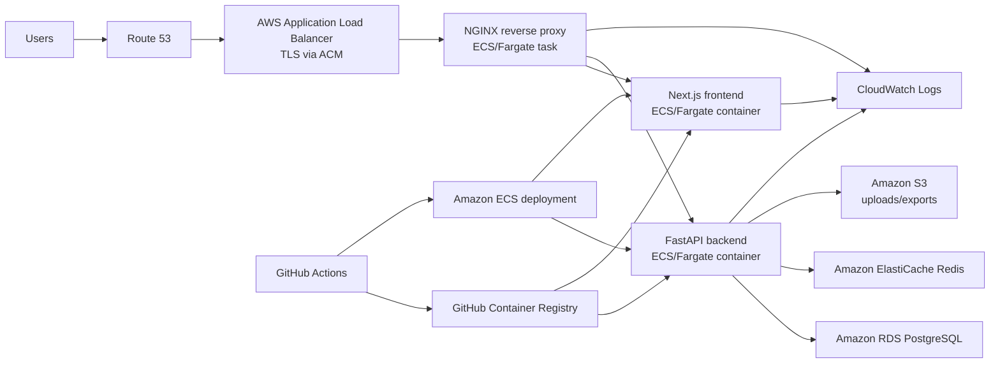

# DevWorkspace X Production Architecture

## Runtime Flow

1. Route 53 points the application domain to an AWS Application Load Balancer.
2. ACM terminates TLS at the load balancer.
3. The load balancer forwards HTTP traffic to the NGINX container.
4. NGINX routes `/api/*`, `/health`, and `/notifications/ws` WebSocket traffic to FastAPI and all other requests to Next.js.
5. FastAPI stores relational data in PostgreSQL, uses Redis for cache/queue-oriented workloads, and writes structured logs to stdout/file for CloudWatch collection.
6. GitHub Actions validates, builds, publishes images to GHCR, triggers ECS redeployment, runs migrations, and checks `/health`.
